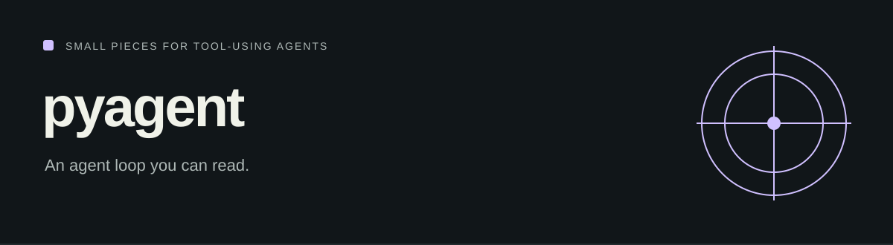

# pyagent

<!-- repo-badges:start -->
<div align="center">

[](https://github.com/honeyamn10-source/pyagent/stargazers)
[](https://github.com/honeyamn10-source/pyagent/forks)
[](https://github.com/honeyamn10-source/pyagent/issues)
[](https://github.com/honeyamn10-source/pyagent/commits/main)

[Repository](https://github.com/honeyamn10-source/pyagent) · [Issues](https://github.com/honeyamn10-source/pyagent/issues) · [Pull Requests](https://github.com/honeyamn10-source/pyagent/pulls) · [Actions](https://github.com/honeyamn10-source/pyagent/actions)

</div>
<!-- repo-badges:end -->


A Python framework for model calls, typed tools, conversation memory and middleware, with an OpenAI-compatible client.

[Project website](https://honeyamn10-source.github.io/pyagent/) · [Source](https://github.com/honeyamn10-source/pyagent) · [Build results](https://github.com/honeyamn10-source/pyagent/actions) · [Issues](https://github.com/honeyamn10-source/pyagent/issues)

## What it does

- **Define tools.** Describe Python functions with the tool decorator and keep execution explicit.
- **Connect a model.** Use an OpenAI-compatible endpoint and configure the provider yourself.
- **Inspect the loop.** Agent, parsing, memory and middleware live in separate, readable modules.

## Start from source

See pyproject.toml for supported Python versions. The example requires an API key or a configured local endpoint.

```bash
git clone https://github.com/honeyamn10-source/pyagent.git
cd pyagent
python -m pip install .
python examples/calculator_agent.py
```

The example reads `OPENAI_API_KEY`, `OPENAI_BASE_URL` and `OPENAI_MODEL` from the environment. For a local endpoint, configure the exact installed model. See [docs/usage.md](docs/usage.md) for tool definitions, memory and middleware.

## Check your changes

```bash
python -m pip install pytest
python -m pytest tests -q
```

These are the repository’s checks, not a claim of complete test coverage. See [GitHub Actions](https://github.com/honeyamn10-source/pyagent/actions) for the result on a specific commit.

## Scope and limitations

Model quality and costs depend on the provider. Tools run with the permissions you give their Python process; this library is not an operating-system sandbox.

## Find your way around

| Source | Purpose |
| --- | --- |
| [`examples/calculator_agent.py`](examples/calculator_agent.py) | Runnable calculator example |
| [`docs/usage.md`](docs/usage.md) | Usage guide |
| [`pyagent/agent.py`](pyagent/agent.py) | Agent loop |

## Contributing

Include the command you ran, your runtime version, a minimal reproduction and the expected result in an issue. Remove credentials and personal data from logs. Follow [CONTRIBUTING.md](CONTRIBUTING.md) when proposing a change.

## License

MIT — see [LICENSE](LICENSE). Third-party dependencies retain their own licenses.
